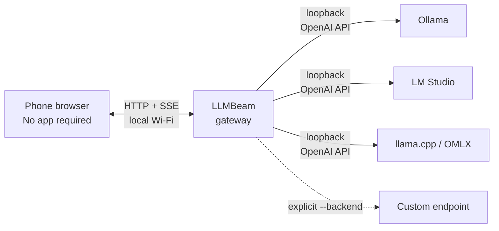

<h1 align="center">LLMBeam</h1>

<p align="center"><a href="README.zh-CN.md">简体中文</a> · <strong>English</strong></p>

<p align="center"><strong>Beam any local LLM to your phone. One command. One scan. Zero cloud.</strong></p>

<p align="center">
  Access Ollama, LM Studio, llama.cpp, OMLX, or any OpenAI-compatible server from the browser already on your phone.
</p>

<p align="center">
  <a href="https://github.com/llmbeam/llmbeam/actions/workflows/ci.yml"></a>
  <a href="https://go.dev/"></a>
  <a href="LICENSE"></a>
  <a href="https://github.com/llmbeam/llmbeam/stargazers"></a>
</p>

<p align="center">
  <a href="#quick-start">Quick start</a> ·
  <a href="#why-llmbeam">Why LLMBeam?</a> ·
  <a href="#security-without-hand-waving">Security</a> ·
  <a href="#faq">FAQ</a>
</p>

<!-- Before launch, add a 10–15 second, <=5 MB demo GIF here: terminal -> QR -> phone -> streaming reply. -->

Your local model is already running on the most powerful machine you own. Why install another app, create an account, or type IP addresses just to use it from the couch?

**LLMBeam is the shortest path from a local model to your phone.** Run one ~10 MB binary, scan the QR code, and start chatting from the browser already on your phone. No Docker. No cloud relay. No runtime dependencies.

```text
$ llmbeam

  Discovered backends:
    ✓ ollama      http://127.0.0.1:11434/v1   (3 models)

  Scan with your phone (same Wi-Fi):

  █▀▀▀▀▀█  ▀▄█  █▀▀▀▀▀█
  █ ███ █  █▀▄  █ ███ █
  █ ▀▀▀ █  ▄██  █ ▀▀▀ █
  ▀▀▀▀▀▀▀  ▀ ▀  ▀▀▀▀▀▀▀

  Or open http://192.168.1.42:8442 and enter code 7KQ2-M9XF
```

## Quick start

### 1. Install

On macOS, install with Homebrew:

```sh
brew install llmbeam/tap/llmbeam
```

Upgrade later with `brew upgrade llmbeam`.

If macOS blocks the first launch with “Apple could not verify `llmbeam` is free of malware,” verify that you installed LLMBeam from this repository and then remove the quarantine attribute:

```sh
xattr -d com.apple.quarantine "$(which llmbeam)"
```

This is a temporary workaround while the macOS binary is not yet Apple-notarized. Do not run it on binaries downloaded from untrusted sources.

On Linux, install the latest verified binary with one command:

```sh
curl -fsSL https://raw.githubusercontent.com/llmbeam/llmbeam/main/install.sh | sh
```

The installer detects amd64 or arm64, verifies the downloaded archive against `checksums.txt`, and installs to `~/.local/bin` without requiring `sudo`. Set `LLMBEAM_INSTALL_DIR` to choose another location.

Prebuilt archives for macOS, Linux, and Windows are also available from [Releases](https://github.com/llmbeam/llmbeam/releases/latest). Each release includes amd64 and arm64 builds plus a `checksums.txt` file.

Alternatively, install with Go 1.27+:

```sh
go install github.com/llmbeam/llmbeam@latest
```

To build from source:

Source builds require Go 1.27+ and Node.js 22; neither is needed to run a prebuilt binary.

```sh
git clone https://github.com/llmbeam/llmbeam.git
cd llmbeam
make build
```

### 2. Start your local model server

For example, with Ollama:

```sh
ollama serve
```

LM Studio, llama.cpp, and OMLX users can start their normal local server instead. LLMBeam discovers them automatically.

### 3. Scan and chat

```sh
llmbeam
```

Scan the QR code with an iPhone or Android phone on the same Wi-Fi. The browser pairs automatically, shows every discovered model, and streams replies token by token.

### Use it from anywhere (experimental)

```sh
llmbeam --remote
```

Scan the new QR code from any network. The public GitHub Pages app loads the chat UI and Tailcat WebAssembly, then opens an end-to-end encrypted TCP connection back to this LLMBeam process through Tailscale DERP relays. No port forwarding, account, domain, or server deployment is required.

Remote access is experimental. Anyone holding the current remote URL and pairing code can attempt to connect until they expire, so do not share the QR or URL. The Tailcat address is ephemeral and stops working when LLMBeam exits. Tailcat currently offers no API or wire-format stability guarantee.

## Why LLMBeam?

| What you want | What LLMBeam does |
| --- | --- |
| Use your local LLM from the sofa | Opens a touch-friendly web UI on any phone |
| Start now, not after a deployment | Ships the Go server and Preact UI in one static binary |
| Keep your existing model stack | Speaks the standard OpenAI `/models` and `/chat/completions` APIs |
| Avoid fiddly mobile setup | Encodes the LAN address and one-time pairing code in a QR |
| See the answer immediately | Proxies upstream SSE without buffering the full response |
| Keep local inference local | Auto-discovered backends are loopback-only; no cloud service is involved |

Other useful details:

- **Automatic discovery:** scans every localhost port for Ollama, LM Studio, llama.cpp, OMLX, and other OpenAI-compatible servers.
- **Multiple backends:** choose namespaced models such as `ollama/llama3.2` or `lm-studio/qwen2.5` from one picker.
- **Bring your own endpoint:** repeat `--backend URL` for any OpenAI-compatible server.
- **Mobile-first UI:** safe-area support, streaming Markdown, model switching, and a Stop button.
- **Ephemeral by design:** the gateway stores no chat history; in-memory sessions disappear when it restarts.
- **Zero runtime baggage:** no Docker, Node.js, Python, database, or account system.

## Supported backends

| Backend | Auto-detected endpoint | Status |
| --- | --- | --- |
| [Ollama](https://ollama.com/) | Default or custom localhost port | Automatic |
| [LM Studio](https://lmstudio.ai/) | Default or custom localhost port | Automatic |
| [llama.cpp](https://github.com/ggml-org/llama.cpp) | Default or custom localhost port | Automatic |
| OMLX | Default or custom localhost port | Automatic |
| [vLLM](https://github.com/vllm-project/vllm) | Usually `8000`, or any localhost port | Automatic |
| [SGLang](https://github.com/sgl-project/sglang) | Usually `30000`, or any localhost port | Automatic |
| [Jan](https://github.com/janhq/jan) | Usually `1337`, or any localhost port | Automatic |
| [LocalAI](https://github.com/mudler/LocalAI) | Usually `8080`, or any localhost port | Automatic |
| [MLX-LM](https://github.com/ml-explore/mlx-lm) | Usually `8080` on Apple Silicon | Automatic |
| [LMDeploy](https://github.com/InternLM/lmdeploy) | Usually `23333`, or any localhost port | Automatic |
| [Xinference](https://github.com/xorbitsai/inference) | Usually `9997`, or any localhost port | Automatic |
| [LiteLLM](https://github.com/BerriAI/LiteLLM) | Usually `4000`, or any localhost port | Automatic |
| [TensorRT-LLM](https://github.com/NVIDIA/TensorRT-LLM) | Usually `8000`, or any localhost port | Automatic |
| [MLC LLM](https://github.com/mlc-ai/mlc-llm) | Configurable OpenAI-compatible server | Automatic |
| [llamafile](https://github.com/Mozilla-Ocho/llamafile) | Usually `8080`, or any localhost port | Automatic |
| [KoboldCpp](https://github.com/LostRuins/KoboldCpp) | Usually `5001`, or any localhost port | Automatic |
| [GPT4All](https://github.com/nomic-ai/gpt4all) | Usually `4891`, or any localhost port | Automatic |
| [Text Generation Inference](https://github.com/huggingface/text-generation-inference) | Usually `8080`, or any localhost port | Automatic |
| Any OpenAI-compatible API | Standard `/v1` on any localhost port | Automatic |
| Remote or non-standard API path | `llmbeam --backend http://host:port/path` | Manual |

At startup, LLMBeam scans `127.0.0.1:1-65535` and keeps only services that return a valid OpenAI `GET /v1/models` response. It never scans your LAN or public network. Non-default endpoints receive a stable ID such as `local-18080`; authenticated matches use the framework name, such as `vllm-18080`. A compatible backend should expose `POST /v1/chat/completions`; streaming responses are forwarded directly, while GPT4All's non-streaming JSON response is converted to SSE for the browser.

### Authenticated backends

API keys stay on the computer and are attached to both model discovery and chat requests as Bearer credentials. Set the matching environment variable before starting LLMBeam:

| Backend | LLMBeam variable | Native fallback |
| --- | --- | --- |
| Ollama or an authenticated Ollama proxy | `LLMBEAM_OLLAMA_API_KEY` | — |
| LM Studio | `LLMBEAM_LM_STUDIO_API_KEY` | — |
| llama.cpp | `LLMBEAM_LLAMA_CPP_API_KEY` | `LLAMA_ARG_API_KEY` |
| OMLX | `LLMBEAM_OMLX_API_KEY` | `OMLX_API_KEY`, then OMLX `settings.json` |
| vLLM | `LLMBEAM_VLLM_API_KEY` | `VLLM_API_KEY` |
| SGLang | `LLMBEAM_SGLANG_API_KEY` | `SGLANG_API_KEY` |
| LocalAI | `LLMBEAM_LOCALAI_API_KEY` | `LOCALAI_API_KEY` |
| LiteLLM | `LLMBEAM_LITELLM_API_KEY` | `LITELLM_MASTER_KEY`, then `LITELLM_API_KEY` |
| Xinference | `LLMBEAM_XINFERENCE_API_KEY` | `XINFERENCE_API_KEY` |
| LMDeploy | `LLMBEAM_LMDEPLOY_API_KEY` | `LMDEPLOY_API_KEY` |
| MLX-LM | `LLMBEAM_MLX_LM_API_KEY` | — |
| Jan, TensorRT-LLM, MLC LLM, llamafile, KoboldCpp, GPT4All, or TGI | `LLMBEAM_<BACKEND>_API_KEY` | — |
| Auto-discovered custom port, for example `18080` | `LLMBEAM_LOCAL_18080_API_KEY` | — |
| First `--backend` | `LLMBEAM_CUSTOM_1_API_KEY` | — |
| Second `--backend` | `LLMBEAM_CUSTOM_2_API_KEY` | — |

When a scanned non-default port returns `401`, LLMBeam retries with configured framework credentials, including OMLX's settings file. A successful match keeps using that credential source for model refreshes and chat. Framework credentials are not sent when the initial endpoint response is anything other than `401`.

The same `LLMBEAM_CUSTOM_N_API_KEY` pattern works for vLLM, LocalAI, or any other authenticated OpenAI-compatible server, where `N` follows the order of `--backend` flags. LLMBeam never sends these keys to the phone or includes them in logs and error responses.

## How it works



The QR URL keeps its pairing code in the fragment, so the code never appears in HTTP access logs. The web client exchanges it once for an opaque session cookie, then talks only to LLMBeam. The gateway resolves the selected model to its backend and forwards the chat stream.

## Security without hand-waving

LLMBeam is designed for a **trusted home or office LAN**, not the public internet.

- Pairing codes use `crypto/rand`, expire after 10 minutes by default, and rotate immediately after successful use.
- Sessions use random 32-byte tokens in `HttpOnly`, `SameSite=Lax` cookies.
- Five failed pairing attempts from one IP in one minute trigger a five-minute lockout.
- Every chat, model, and session route requires authentication.
- Foreign-origin POST requests are rejected, and restrictive browser security headers are enabled.
- Auto-discovered model servers are always loopback addresses. Non-loopback `--backend` values are explicit operator choices and produce a warning.
- Backend API keys remain in the gateway process and are never exposed to paired browsers.

**Important:** local mode serves plain HTTP on your LAN. Traffic is not encrypted in transit, so do not port-forward its HTTP port or use it on an untrusted network. Experimental `--remote` traffic uses Tailcat's encrypted transport and Tailscale DERP relays.

For implementation details, see [`internal/pair`](internal/pair) and [`internal/server`](internal/server).

## CLI

```text
llmbeam [options]

  --port 8442             LAN port to listen on
  --backend URL           extra OpenAI-compatible base URL; repeatable
  --no-qr                 print the address and code without a QR
  --code-ttl 10m          pairing-code lifetime
  --version               print the version and exit
```

Examples:

```sh
# Use a custom vLLM, LocalAI, or other compatible server
llmbeam --backend http://127.0.0.1:8000/v1

# Run on a different port with a shorter pairing window
llmbeam --port 9000 --code-ttl 2m
```

## Compared with alternatives

These are all good projects with different goals:

| | LLMBeam | Open WebUI | LM Link | Native mobile apps |
| --- | --- | --- | --- | --- |
| Best for | Instant, ephemeral LAN access | Full multi-user web platform | LM Studio remote access | Deep mobile integration |
| Computer setup | One binary | Deploy an application/container | Included with LM Studio | Varies |
| Phone setup | Scan QR; use browser | Open URL and sign in | Scan from LM Studio | Install and configure |
| Backend scope | Any OpenAI-compatible API | Broad integrations | LM Studio | Varies |
| Server-side chat history | None | Yes | Product-dependent | App-dependent |

Choose Open WebUI when you want accounts, persistence, and a larger platform. Choose LM Link when your workflow is entirely inside LM Studio. Choose a native app when OS-level integration matters most. Choose LLMBeam when you want the shortest path from a running local model to any phone browser.

## FAQ

<details>
<summary><strong>Does LLMBeam send prompts to the cloud?</strong></summary>

No. LLMBeam itself has no cloud service or telemetry. By default it only connects to model servers on your computer's loopback interface. If you configure a remote `--backend`, that endpoint's own privacy policy applies.

</details>

<details>
<summary><strong>Does it work on iPhone and Android?</strong></summary>

Yes. It uses standard browser APIs and requires no native app. Where the browser permits, the page can also be added to the home screen.

</details>

<details>
<summary><strong>Can several local backends run at once?</strong></summary>

Yes. LLMBeam groups models by backend and namespaces their IDs so models with the same upstream name remain unambiguous.

</details>

<details>
<summary><strong>Where is chat history stored?</strong></summary>

The gateway does not persist chat history. The current conversation lives only in the open browser page and disappears when that page is refreshed or closed. Your model backend may have its own logging behavior.

</details>

<details>
<summary><strong>Can I use it away from home?</strong></summary>

Yes, with the experimental `llmbeam --remote` mode. Do not expose the local HTTP port directly to the internet; use the generated remote URL instead.

</details>

## Roadmap

- [x] Experimental encrypted remote access through Tailcat and DERP.
- [ ] Tailscale Serve and Cloudflare Quick Tunnel adapters.
- [ ] Device management with individual session revocation.
- [ ] Sidecar and Go library modes for embedding LLMBeam elsewhere.
- [ ] Optional vision/image passthrough.

Have a use case that should shape the roadmap? [Open an issue](https://github.com/llmbeam/llmbeam/issues).

## Contributing

Small, focused contributions are welcome. The project intentionally keeps the Go server dependency-light and the web client compact.

```sh
make test
make web
```

For bug reports, include your OS, backend, model server version, browser, and the terminal output with secrets removed.

## Help more people find LLMBeam

If LLMBeam removes one annoying step from your local-LLM setup, consider [starring the repository](https://github.com/llmbeam/llmbeam). It helps other local-AI builders discover the project.

## License

[MIT](LICENSE) © 2026 Shaohua Li
