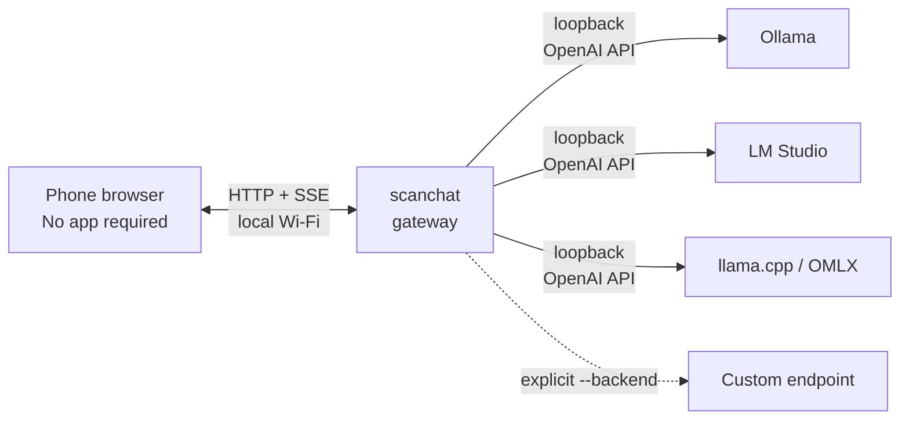

<h1 align="center">scanchat</h1>

<p align="center"><a href="README.zh-CN.md">简体中文</a> · <strong>English</strong></p>

<p align="center"><strong>One binary. Any local LLM. Scan and chat.</strong></p>

<p align="center">
  Turn Ollama, LM Studio, llama.cpp, or any OpenAI-compatible server into a private mobile chat UI in seconds.
</p>

<p align="center">
  <a href="https://github.com/shao-hua-li/scanchat/actions/workflows/ci.yml"></a>
  <a href="https://go.dev/"></a>
  <a href="LICENSE"></a>
  <a href="https://github.com/shao-hua-li/scanchat/stargazers"></a>
</p>

<p align="center">
  <a href="#quick-start">Quick start</a> ·
  <a href="#why-scanchat">Why scanchat?</a> ·
  <a href="#security-without-hand-waving">Security</a> ·
  <a href="#faq">FAQ</a>
</p>

<!-- Before launch, add a 10–15 second, <=5 MB demo GIF here: terminal -> QR -> phone -> streaming reply. -->

Your local model is already running on the most powerful machine you own. Why install another app, create an account, or type IP addresses just to use it from the couch?

**scanchat is the missing last meter.** Run one ~10 MB binary, scan the QR code, and start chatting from the browser already on your phone. No Docker. No cloud relay. No runtime dependencies.

```text
$ scanchat

  Discovered backends:
    ✓ ollama      http://127.0.0.1:11434/v1   (3 models)

  Scan with your phone (same Wi-Fi):

  █▀▀▀▀▀█  ▀▄█  █▀▀▀▀▀█
  █ ███ █  █▀▄  █ ███ █
  █ ▀▀▀ █  ▄██  █ ▀▀▀ █
  ▀▀▀▀▀▀▀  ▀ ▀  ▀▀▀▀▀▀▀

  Or open http://192.168.1.42:8442 and enter code 7KQ2-M9XF
```

## Quick start

### 1. Install

Download a prebuilt binary for macOS, Linux, or Windows from [Releases](https://github.com/shao-hua-li/scanchat/releases/latest), or install with Go 1.22+:

```sh
go install github.com/shao-hua-li/scanchat@latest
```

To build from source:

Source builds require Go 1.22+ and Node.js 22; neither is needed to run a prebuilt binary.

```sh
git clone https://github.com/shao-hua-li/scanchat.git
cd scanchat
make build
```

### 2. Start your local model server

For example, with Ollama:

```sh
ollama serve
```

LM Studio and llama.cpp users can start their normal local server instead. scanchat discovers them automatically.

### 3. Scan and chat

```sh
scanchat
```

Scan the QR code with an iPhone or Android phone on the same Wi-Fi. The browser pairs automatically, shows every discovered model, and streams replies token by token.

## Why scanchat?

| What you want | What scanchat does |
| --- | --- |
| Use your local LLM from the sofa | Opens a touch-friendly web UI on any phone |
| Start now, not after a deployment | Ships the Go server and Preact UI in one static binary |
| Keep your existing model stack | Speaks the standard OpenAI `/models` and `/chat/completions` APIs |
| Avoid fiddly mobile setup | Encodes the LAN address and one-time pairing code in a QR |
| See the answer immediately | Proxies upstream SSE without buffering the full response |
| Keep local inference local | Auto-discovered backends are loopback-only; no cloud service is involved |

Other useful details:

- **Automatic discovery:** Ollama, LM Studio, llama.cpp, and OMLX on macOS.
- **Multiple backends:** choose namespaced models such as `ollama/llama3.2` or `lm-studio/qwen2.5` from one picker.
- **Bring your own endpoint:** repeat `--backend URL` for any OpenAI-compatible server.
- **Mobile-first UI:** safe-area support, streaming Markdown, model switching, and a Stop button.
- **Ephemeral by design:** the gateway stores no chat history; in-memory sessions disappear when it restarts.
- **Zero runtime baggage:** no Docker, Node.js, Python, database, or account system.

## Supported backends

| Backend | Auto-detected endpoint | Status |
| --- | --- | --- |
| [Ollama](https://ollama.com/) | `http://127.0.0.1:11434/v1` | Automatic |
| [LM Studio](https://lmstudio.ai/) | `http://127.0.0.1:1234/v1` | Automatic |
| [llama.cpp](https://github.com/ggml-org/llama.cpp) | `http://127.0.0.1:8080/v1` | Automatic |
| OMLX | `http://127.0.0.1:8000/v1` | Automatic on macOS |
| Any OpenAI-compatible API | `scanchat --backend http://host:port/v1` | Manual |

A compatible backend only needs `GET /models` and streaming `POST /chat/completions` endpoints.

### Authenticated backends

API keys stay on the computer and are attached to both model discovery and chat requests as Bearer credentials. Set the matching environment variable before starting scanchat:

| Backend | scanchat variable | Native fallback |
| --- | --- | --- |
| Ollama or an authenticated Ollama proxy | `SCANCHAT_OLLAMA_API_KEY` | — |
| LM Studio | `SCANCHAT_LM_STUDIO_API_KEY` | — |
| llama.cpp | `SCANCHAT_LLAMA_CPP_API_KEY` | `LLAMA_ARG_API_KEY` |
| OMLX | `SCANCHAT_OMLX_API_KEY` | `OMLX_API_KEY`, then OMLX `settings.json` |
| First `--backend` | `SCANCHAT_CUSTOM_1_API_KEY` | — |
| Second `--backend` | `SCANCHAT_CUSTOM_2_API_KEY` | — |

The same `SCANCHAT_CUSTOM_N_API_KEY` pattern works for vLLM, LocalAI, or any other authenticated OpenAI-compatible server, where `N` follows the order of `--backend` flags. scanchat never sends these keys to the phone or includes them in logs and error responses.

## How it works



The QR URL keeps its pairing code in the fragment, so the code never appears in HTTP access logs. The web client exchanges it once for an opaque session cookie, then talks only to scanchat. The gateway resolves the selected model to its backend and forwards the chat stream.

## Security without hand-waving

scanchat is designed for a **trusted home or office LAN**, not the public internet.

- Pairing codes use `crypto/rand`, expire after 10 minutes by default, and rotate immediately after successful use.
- Sessions use random 32-byte tokens in `HttpOnly`, `SameSite=Lax` cookies.
- Five failed pairing attempts from one IP in one minute trigger a five-minute lockout.
- Every chat, model, and session route requires authentication.
- Foreign-origin POST requests are rejected, and restrictive browser security headers are enabled.
- Auto-discovered model servers are always loopback addresses. Non-loopback `--backend` values are explicit operator choices and produce a warning.
- Backend API keys remain in the gateway process and are never exposed to paired browsers.

**Important:** v1 serves plain HTTP on your LAN. Traffic is not encrypted in transit. Do not port-forward scanchat or use it on an untrusted network. TLS-backed Tailscale and Cloudflare tunnel adapters are planned for v1.1.

For implementation details, see [`internal/pair`](internal/pair) and [`internal/server`](internal/server).

## CLI

```text
scanchat [options]

  --port 8442             LAN port to listen on
  --backend URL           extra OpenAI-compatible base URL; repeatable
  --no-qr                 print the address and code without a QR
  --code-ttl 10m          pairing-code lifetime
  --version               print the version and exit
```

Examples:

```sh
# Use a custom vLLM, LocalAI, or other compatible server
scanchat --backend http://127.0.0.1:8000/v1

# Run on a different port with a shorter pairing window
scanchat --port 9000 --code-ttl 2m
```

## Compared with alternatives

These are all good projects with different goals:

| | scanchat | Open WebUI | LM Link | Native mobile apps |
| --- | --- | --- | --- | --- |
| Best for | Instant, ephemeral LAN access | Full multi-user web platform | LM Studio remote access | Deep mobile integration |
| Computer setup | One binary | Deploy an application/container | Included with LM Studio | Varies |
| Phone setup | Scan QR; use browser | Open URL and sign in | Scan from LM Studio | Install and configure |
| Backend scope | Any OpenAI-compatible API | Broad integrations | LM Studio | Varies |
| Server-side chat history | None | Yes | Product-dependent | App-dependent |

Choose Open WebUI when you want accounts, persistence, and a larger platform. Choose LM Link when your workflow is entirely inside LM Studio. Choose a native app when OS-level integration matters most. Choose scanchat when you want the shortest path from a running local model to any phone browser.

## FAQ

<details>
<summary><strong>Does scanchat send prompts to the cloud?</strong></summary>

No. scanchat itself has no cloud service or telemetry. By default it only connects to model servers on your computer's loopback interface. If you configure a remote `--backend`, that endpoint's own privacy policy applies.

</details>

<details>
<summary><strong>Does it work on iPhone and Android?</strong></summary>

Yes. It uses standard browser APIs and requires no native app. Where the browser permits, the page can also be added to the home screen.

</details>

<details>
<summary><strong>Can several local backends run at once?</strong></summary>

Yes. scanchat groups models by backend and namespaces their IDs so models with the same upstream name remain unambiguous.

</details>

<details>
<summary><strong>Where is chat history stored?</strong></summary>

The gateway does not persist chat history. The current conversation lives only in the open browser page and disappears when that page is refreshed or closed. Your model backend may have its own logging behavior.

</details>

<details>
<summary><strong>Can I use it away from home?</strong></summary>

Not safely in v1. Do not expose the HTTP port directly to the internet. Authenticated TLS tunnel support is on the roadmap.

</details>

## Roadmap

- [ ] Tailscale Serve and Cloudflare Quick Tunnel adapters.
- [ ] Device management with individual session revocation.
- [ ] Sidecar and Go library modes for embedding scanchat elsewhere.
- [ ] Optional vision/image passthrough.

Have a use case that should shape the roadmap? [Open an issue](https://github.com/shao-hua-li/scanchat/issues).

## Contributing

Small, focused contributions are welcome. The project intentionally keeps the Go server dependency-light and the web client compact.

```sh
make test
make web
```

For bug reports, include your OS, backend, model server version, browser, and the terminal output with secrets removed.

## Help more people find scanchat

If scanchat removes one annoying step from your local-LLM setup, consider [starring the repository](https://github.com/shao-hua-li/scanchat). It helps other local-AI builders discover the project.

## License

[MIT](LICENSE) © 2026 Shaohua Li
