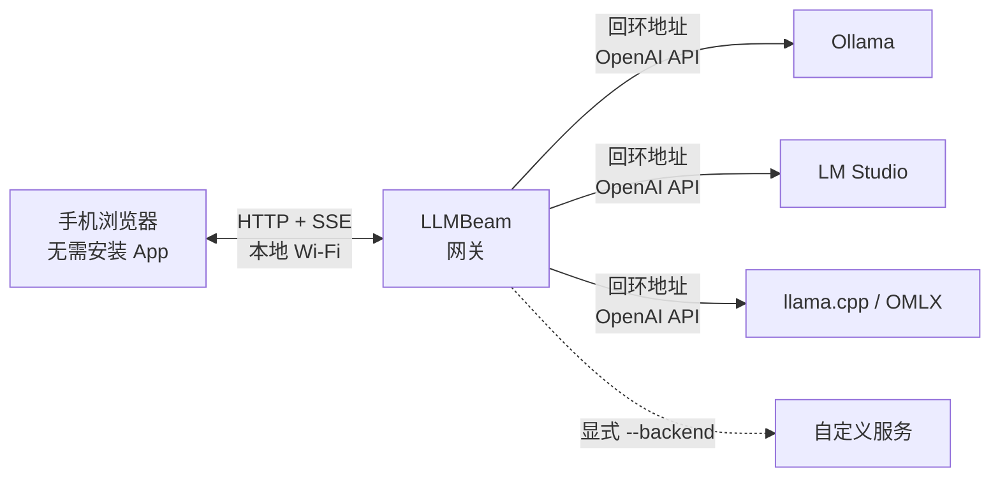

<h1 align="center">LLMBeam</h1>

<p align="center"><strong>简体中文</strong> · <a href="README.md">English</a></p>

<p align="center"><strong>把任意本地大模型传到手机。一个命令，一次扫码，零云端。</strong></p>

<p align="center">
  直接在手机浏览器中访问 Ollama、LM Studio、llama.cpp、OMLX 或任意 OpenAI 兼容服务。
</p>

<p align="center">
  <a href="https://github.com/llmbeam/llmbeam/actions/workflows/ci.yml"></a>
  <a href="https://go.dev/"></a>
  <a href="LICENSE"></a>
  <a href="https://github.com/llmbeam/llmbeam/stargazers"></a>
</p>

<p align="center">
  <a href="#快速开始">快速开始</a> ·
  <a href="#为什么是-llmbeam">为什么是 LLMBeam</a> ·
  <a href="#不回避问题的安全说明">安全说明</a> ·
  <a href="#常见问题">常见问题</a>
</p>

你的本地模型已经运行在手边性能最强的电脑上。只是想躺在沙发上用手机问几个问题，为什么还要安装 App、注册账号、部署 Docker，甚至手动输入 IP 地址？

**LLMBeam 是从本地模型到手机的最短路径。** 运行一个约 10 MB 的二进制文件，扫描二维码，直接在手机浏览器里开始对话。没有云端中转，没有运行时依赖，也不需要改变你现有的模型服务。

```text
$ llmbeam

  Discovered backends:
    ✓ ollama      http://127.0.0.1:11434/v1   (3 models)

  Scan with your phone (same Wi-Fi):

  █▀▀▀▀▀█  ▀▄█  █▀▀▀▀▀█
  █ ███ █  █▀▄  █ ███ █
  █ ▀▀▀ █  ▄██  █ ▀▀▀ █
  ▀▀▀▀▀▀▀  ▀ ▀  ▀▀▀▀▀▀▀

  Or open http://192.168.1.42:8442 and enter code 7KQ2-M9XF
```

## 快速开始

### 1. 安装

macOS 用户可以通过 Homebrew 安装：

```sh
brew install llmbeam/tap/llmbeam
```

后续使用 `brew upgrade llmbeam` 即可升级。

如果 macOS 首次启动时提示“Apple 无法验证 `llmbeam` 是否包含可能危害 Mac 或泄露隐私的恶意软件”，请先确认 LLMBeam 来自本仓库，然后移除隔离属性：

```sh
xattr -d com.apple.quarantine "$(which llmbeam)"
```

这是 macOS 二进制尚未经过 Apple 公证期间的临时解决方案。请勿对来源不可信的二进制文件执行此命令。

Linux 用户可以使用一条命令安装经过校验的最新版本：

```sh
curl -fsSL https://raw.githubusercontent.com/llmbeam/llmbeam/main/install.sh | sh
```

脚本会自动识别 amd64 或 arm64，使用 `checksums.txt` 校验下载的压缩包，并默认安装到 `~/.local/bin`，不需要 `sudo`。设置 `LLMBEAM_INSTALL_DIR` 可以指定其他安装目录。

也可以从 [Releases](https://github.com/llmbeam/llmbeam/releases/latest) 下载 macOS、Linux 或 Windows 的预编译压缩包。每个版本都会提供 amd64、arm64 构建以及 `checksums.txt` 校验文件。

或者使用 Go 1.27+ 安装：

```sh
go install github.com/llmbeam/llmbeam@latest
```

也可以从源码构建。源码构建需要 Go 1.27+ 和 Node.js 22；运行预编译版本不需要它们。

```sh
git clone https://github.com/llmbeam/llmbeam.git
cd llmbeam
make build
```

### 2. 启动本地模型服务

以 Ollama 为例：

```sh
ollama serve
```

LM Studio、llama.cpp 和 OMLX 用户只需照常启动自己的本地服务，LLMBeam 会自动发现它们。

### 3. 扫码开始对话

```sh
llmbeam
```

让手机和电脑连接同一个 Wi-Fi，然后用 iPhone 或 Android 手机扫描终端里的二维码。浏览器会自动完成配对，列出已发现的模型，并实时流式显示回答。

### 将局域网模型变成本地 OpenAI 接口

如果另一台电脑上的 Codex、Cursor 或 Continue 需要使用 PC A 上的模型，可以使用原生 connector，无需在 PC A 上安装额外服务：

```sh
# PC A：运行模型和 LLMBeam
llmbeam

# PC B：自动发现 PC A，并提示输入 6 位 Connect Code
llmbeam connect
```

LLMBeam 会在局域网发布 mDNS `_llmbeam._tcp` 服务。PC B 随后会启动类似 `http://127.0.0.1:8333/v1` 的仅回环接口，并打印临时本地 API key。将这个 Base URL 和 API key 填入你的 Agent。两端支持时，connector 模型流量会使用临时 TLS 端点和证书指纹锁定；手机二维码流程仍使用普通 HTTP 端口。

Connect Code 会显示在 PC A 的终端中，格式为 `LAN connector code: XXX-XXX`，有效期为 5 分钟。它与浏览器二维码配对码是两套独立的码。

使用 OpenAI SDK 时，将 `base_url` 设置为输出的 `/v1` 地址，并将 `api_key` 设置为输出的本地密钥。在 Codex、Cursor 或 Continue 中选择 OpenAI-compatible provider，填入相同的 Base URL 和 API key 即可。

如果防火墙或 Wi-Fi 隔离导致 mDNS 不可用，可以手动指定主机：

```sh
llmbeam connect --host 192.168.50.242:8442 --listen 127.0.0.1:8333
```

手动使用安全端点时，传入广播的证书指纹：

```sh
llmbeam connect --host https://192.168.50.242:8443 \
  --fingerprint <sha256-fingerprint>
```

### 从任意网络使用（实验性）

```sh
llmbeam --remote
```

现在可以在任意网络扫码。GitHub Pages 上的公共连接页会加载聊天界面和 Tailcat WebAssembly，再通过 Tailscale DERP 中继与当前 LLMBeam 进程建立端到端加密的 TCP 连接。不需要端口转发、账号、域名或自行部署服务器。

远程模式仍处于实验阶段。拿到当前远程 URL 和配对码的人在其过期前都可以尝试连接，请勿分享二维码或 URL。Tailcat 地址是临时的，LLMBeam 退出后立即失效；Tailcat 目前也不保证 API 与线路协议的稳定性。

## 为什么是 LLMBeam？

| 你想要的体验 | LLMBeam 如何做到 |
| --- | --- |
| 在沙发上使用电脑里的本地模型 | 在任意手机浏览器中打开触屏友好的聊天界面 |
| 不想为了聊天部署一整套平台 | Go 服务端和 Preact 前端打包在同一个静态二进制中 |
| 保留现有模型工具链 | 直接使用标准 OpenAI `/models` 和 `/chat/completions` API |
| 不想在手机上配置地址和端口 | 二维码自动携带局域网地址和一次性配对码 |
| 希望回答立刻出现 | 原样转发上游 SSE，不等待完整回答生成 |
| 希望本地推理保持本地 | 自动发现的后端只连接电脑回环地址，不经过云服务 |

更多实用特性：

- **自动发现：** 扫描全部本机端口，自动找到 Ollama、LM Studio、llama.cpp、OMLX 和其他 OpenAI 兼容服务。
- **多个后端同时使用：** 在同一个模型选择器中切换 `ollama/llama3.2`、`lm-studio/qwen2.5` 等模型。
- **兼容更多服务：** 重复传入 `--backend URL` 即可添加任意 OpenAI 兼容接口。
- **手机优先的 UI：** 支持安全区域、流式 Markdown、模型切换和停止生成。
- **默认不留痕：** 网关不保存聊天记录；重启后内存中的配对会话全部失效。
- **零运行时负担：** 不需要 Docker、Node.js、Python、数据库或账号系统。

## 支持的后端

| 后端 | 自动探测地址 | 接入方式 |
| --- | --- | --- |
| [Ollama](https://ollama.com/) | 本机默认或自定义端口 | 自动 |
| [LM Studio](https://lmstudio.ai/) | 本机默认或自定义端口 | 自动 |
| [llama.cpp](https://github.com/ggml-org/llama.cpp) | 本机默认或自定义端口 | 自动 |
| OMLX | 本机默认或自定义端口 | 自动 |
| [vLLM](https://github.com/vllm-project/vllm) | 通常为 `8000`，也支持本机任意端口 | 自动 |
| [SGLang](https://github.com/sgl-project/sglang) | 通常为 `30000`，也支持本机任意端口 | 自动 |
| [Jan](https://github.com/janhq/jan) | 通常为 `1337`，也支持本机任意端口 | 自动 |
| [LocalAI](https://github.com/mudler/LocalAI) | 通常为 `8080`，也支持本机任意端口 | 自动 |
| [MLX-LM](https://github.com/ml-explore/mlx-lm) | Apple Silicon 通常为 `8080` | 自动 |
| [LMDeploy](https://github.com/InternLM/lmdeploy) | 通常为 `23333`，也支持本机任意端口 | 自动 |
| [Xinference](https://github.com/xorbitsai/inference) | 通常为 `9997`，也支持本机任意端口 | 自动 |
| [LiteLLM](https://github.com/BerriAI/LiteLLM) | 通常为 `4000`，也支持本机任意端口 | 自动 |
| [TensorRT-LLM](https://github.com/NVIDIA/TensorRT-LLM) | 通常为 `8000`，也支持本机任意端口 | 自动 |
| [MLC LLM](https://github.com/mlc-ai/mlc-llm) | OpenAI 兼容服务，端口可配置 | 自动 |
| [llamafile](https://github.com/Mozilla-Ocho/llamafile) | 通常为 `8080`，也支持本机任意端口 | 自动 |
| [KoboldCpp](https://github.com/LostRuins/KoboldCpp) | 通常为 `5001`，也支持本机任意端口 | 自动 |
| [GPT4All](https://github.com/nomic-ai/gpt4all) | 通常为 `4891`，也支持本机任意端口 | 自动 |
| [Text Generation Inference](https://github.com/huggingface/text-generation-inference) | 通常为 `8080`，也支持本机任意端口 | 自动 |
| 任意 OpenAI 兼容服务 | 本机任意端口上的标准 `/v1` 路径 | 自动 |
| 远程服务或非标准 API 路径 | `llmbeam --backend http://host:port/path` | 手动添加 |

LLMBeam 启动时会扫描 `127.0.0.1:1-65535`，只保留能够返回合法 OpenAI `GET /v1/models` 响应的服务；它不会扫描局域网设备或公网。非默认端口会获得 `local-18080` 这样的稳定标识，使用框架凭据匹配成功时则显示为 `vllm-18080`。兼容后端应实现 `POST /v1/chat/completions`；流式响应会直接转发，GPT4All 的非流式 JSON 响应则会转换为浏览器使用的 SSE。

### 需要 API key 的后端

API key 始终留在电脑上，LLMBeam 会为模型发现和聊天请求统一添加 Bearer 凭据。启动 LLMBeam 前，设置对应的环境变量即可：

| 后端 | LLMBeam 环境变量 | 原生配置回退 |
| --- | --- | --- |
| Ollama 或带认证的 Ollama 代理 | `LLMBEAM_OLLAMA_API_KEY` | — |
| LM Studio | `LLMBEAM_LM_STUDIO_API_KEY` | — |
| llama.cpp | `LLMBEAM_LLAMA_CPP_API_KEY` | `LLAMA_ARG_API_KEY` |
| OMLX | `LLMBEAM_OMLX_API_KEY` | `OMLX_API_KEY`，然后读取 OMLX `settings.json` |
| vLLM | `LLMBEAM_VLLM_API_KEY` | `VLLM_API_KEY` |
| SGLang | `LLMBEAM_SGLANG_API_KEY` | `SGLANG_API_KEY` |
| LocalAI | `LLMBEAM_LOCALAI_API_KEY` | `LOCALAI_API_KEY` |
| LiteLLM | `LLMBEAM_LITELLM_API_KEY` | `LITELLM_MASTER_KEY`，然后 `LITELLM_API_KEY` |
| Xinference | `LLMBEAM_XINFERENCE_API_KEY` | `XINFERENCE_API_KEY` |
| LMDeploy | `LLMBEAM_LMDEPLOY_API_KEY` | `LMDEPLOY_API_KEY` |
| MLX-LM | `LLMBEAM_MLX_LM_API_KEY` | — |
| Jan、TensorRT-LLM、MLC LLM、llamafile、KoboldCpp、GPT4All 或 TGI | `LLMBEAM_<BACKEND>_API_KEY` | — |
| 自动发现的自定义端口，例如 `18080` | `LLMBEAM_LOCAL_18080_API_KEY` | — |
| 第一个 `--backend` | `LLMBEAM_CUSTOM_1_API_KEY` | — |
| 第二个 `--backend` | `LLMBEAM_CUSTOM_2_API_KEY` | — |

扫描到的非默认端口返回 `401` 时，LLMBeam 会尝试当前已配置的框架凭据，包括从 OMLX 设置文件自动读取的密钥。匹配成功后，模型刷新和聊天请求会持续使用同一凭据来源。初始响应不是 `401` 时，不会发送任何框架密钥。

vLLM、LocalAI 和其他需要认证的 OpenAI 兼容服务都使用相同的 `LLMBEAM_CUSTOM_N_API_KEY` 规则，其中 `N` 与 `--backend` 参数的顺序一致。LLMBeam 不会把这些密钥发送给手机，也不会把它们写入日志或错误响应。

## 工作原理



二维码 URL 将配对码放在 fragment 中，因此它不会进入 HTTP 访问日志。网页只使用一次配对码换取不可预测的会话 Cookie，之后所有请求都发给 LLMBeam。网关根据选中的模型找到对应后端，并把流式回答转发给手机。

## 不回避问题的安全说明

LLMBeam 面向的是**可信的家庭或办公室局域网**，不是公网。

- 配对码由 `crypto/rand` 生成，默认 10 分钟过期，成功使用后立即轮换。
- 会话使用随机 32 字节 token，并保存在 `HttpOnly`、`SameSite=Lax` Cookie 中。
- 同一 IP 一分钟内配对失败五次后，将被锁定五分钟。
- 聊天、模型列表和会话接口全部要求认证。
- 来自其他 Origin 的 POST 请求会被拒绝，并启用了严格的浏览器安全响应头。
- 自动发现的模型服务始终使用回环地址；非回环的 `--backend` 必须由用户显式指定，并会显示警告。
- 所有后端 API key 都只保存在 LLMBeam 网关进程中，不写入日志，也不会发送给手机。
- 原生 connector 使用独立的本地 API key，仅在 PC A 请求时注入远端 connector token。
- 如果主机发布了 TLS connector，模型流量会使用临时证书和 SHA-256 指纹锁定；Unix 凭据文件权限为 `0600`。

**请注意：** 手机浏览器配对端口仍然在局域网中使用明文 HTTP，请勿将其转发到公网，也不要在不可信网络中使用。原生 connector 在广播 TLS 端点时会使用独立的指纹锁定 TLS 端口。实验性的 `--remote` 模式使用 Tailcat 加密传输与 Tailscale DERP 中继。

实现细节可以查看 [`internal/pair`](internal/pair) 和 [`internal/server`](internal/server)。

## 命令行参数

```text
llmbeam [options]

llmbeam connect [options]

  --port 8442             监听的局域网端口
  --backend URL           额外的 OpenAI 兼容 API，可重复指定
  --no-qr                 只显示地址和配对码，不显示二维码
  --code-ttl 10m          配对码有效时间
  --version               显示版本并退出

connect 选项：
  --host HOST             host:port 或 HTTPS URL，跳过 mDNS 自动发现
  --fingerprint HEX       HTTPS 主机的 SHA-256 指纹
  --listen 127.0.0.1:0   本地回环接口（0 表示自动选择端口）
  --timeout 3s            mDNS 发现超时时间
```

示例：

```sh
# 添加 vLLM、LocalAI 或其他兼容服务
llmbeam --backend http://127.0.0.1:8000/v1

# 更换端口，并缩短配对窗口
llmbeam --port 9000 --code-ttl 2m
```

## 与其他方案相比

这些项目都很优秀，只是解决的问题不同：

| | LLMBeam | Open WebUI | LM Link | 原生手机 App |
| --- | --- | --- | --- | --- |
| 最适合 | 即开即用、临时的局域网访问 | 完整的多用户 Web 平台 | LM Studio 远程访问 | 深度移动系统集成 |
| 电脑端准备 | 一个二进制 | 部署应用或容器 | LM Studio 内置 | 视应用而定 |
| 手机端准备 | 扫码后直接使用浏览器 | 打开地址并登录 | 从 LM Studio 扫码 | 安装并配置 App |
| 后端范围 | 任意 OpenAI 兼容 API | 广泛的集成能力 | LM Studio | 视应用而定 |
| 服务端聊天历史 | 不保存 | 保存 | 视产品而定 | 视应用而定 |

如果你需要账号、持久化和完整平台能力，请选择 Open WebUI；如果工作流完全围绕 LM Studio，请选择 LM Link；如果更看重系统级移动体验，请选择原生 App。**如果你只想用最短路径把正在运行的本地模型送到手机浏览器，选择 LLMBeam。**

## 常见问题

<details>
<summary><strong>LLMBeam 会把提示词发送到云端吗？</strong></summary>

不会。LLMBeam 本身没有云服务，也没有遥测。默认情况下，它只连接电脑回环地址上的模型服务。如果你显式配置远程 `--backend`，则需要遵循对应服务自己的隐私策略。

</details>

<details>
<summary><strong>支持 iPhone 和 Android 吗？</strong></summary>

支持。LLMBeam 使用标准浏览器能力，不需要安装原生 App。如果浏览器允许，也可以把页面添加到主屏幕。

</details>

<details>
<summary><strong>可以同时运行多个本地后端吗？</strong></summary>

可以。LLMBeam 会按后端对模型进行分组，并给模型 ID 加上后端命名空间，因此不同后端中同名模型也不会冲突。

</details>

<details>
<summary><strong>聊天记录保存在哪里？</strong></summary>

网关不持久化聊天记录。当前对话只存在于打开的浏览器页面中，刷新或关闭页面后就会消失。模型后端本身是否记录请求，取决于对应后端的行为。

</details>

<details>
<summary><strong>可以在外网使用吗？</strong></summary>

可以使用实验性的 `llmbeam --remote` 模式。请勿直接把本地 HTTP 端口暴露到公网，而应使用命令生成的远程 URL。

</details>

## 路线图

- [x] 基于 Tailcat 与 DERP 的实验性加密远程访问。
- [ ] Tailscale Serve 和 Cloudflare Quick Tunnel 适配。
- [ ] 设备管理与单独撤销会话。
- [ ] Sidecar 模式和可嵌入的 Go 库。
- [ ] 可选的视觉模型与图片透传。

有希望影响路线图的使用场景？欢迎[提交 Issue](https://github.com/llmbeam/llmbeam/issues)。

## 参与贡献

欢迎小而专注的贡献。这个项目会继续保持 Go 服务端依赖轻量、Web 客户端紧凑。

```sh
make test
make web
```

提交 Bug 时，请附上操作系统、使用的后端、模型服务版本、浏览器，以及移除敏感信息后的终端输出。

## 让更多人发现 LLMBeam

如果 LLMBeam 帮你省掉了本地大模型使用流程中一个令人烦恼的步骤，欢迎给项目一个 [Star](https://github.com/llmbeam/llmbeam)。你的支持会帮助更多本地 AI 用户发现它。

## 开源协议

[MIT](LICENSE) © 2026 Shaohua Li
